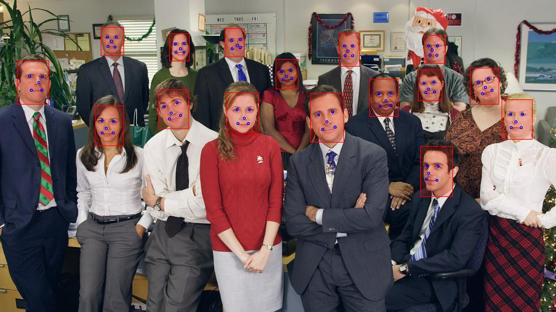

# Wing Loss

This is an implementation of the loss function from  
[Wing Loss for Robust Facial Landmark Localisation with Convolutional Neural Networks](https://arxiv.org/abs/1711.06753).

## How to use a pretrained model
1. Download a pretrained model from [here](https://drive.google.com/drive/folders/1yCGoE6wC8ZOVDX8DekkEtZZIxfP0wnVU?usp=sharing).
2. See an example of usage in `inference/try_detector.ipynb`.

## Example

## Notes
1. I didn't train on any datasets in the paper.
2. I simply trained on CelebA dataset (it has five landmark locations for each face).
3. I use a detector from [here](https://github.com/TropComplique/FaceBoxes-tensorflow) to detect faces.
4. The inference speed is ~0.15 ms per image (video card is NVIDIA GeForce GTX 1080 Ti, batch size is 8).
5. I used procrustes analysis for data balancing (see `data/explore_and_prepare_CelebA.ipynb`).

## Requirements
1. tensorflow 1.12
2. numpy, Pillow, tqdm
